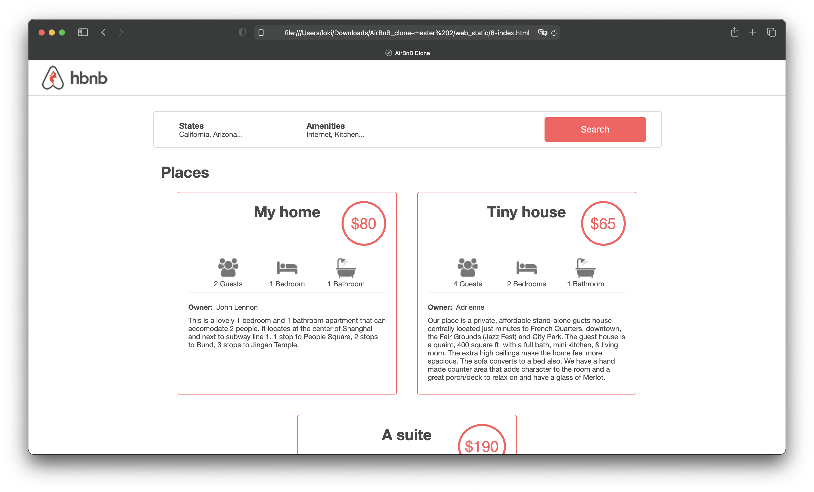

# 0x01. AirBnB clone - Web static

## Resources

- [Learn to code HTML and CSS](https://intranet.alxswe.com/rltoken/T9KyiA6_Tm3Ny6oTn08S-A)
- [Inline styles in HTML](https://intranet.alxswe.com/rltoken/7NdYbImFNofpB_FXXn3otg)
- [Specifics on CSS Specificities](https://intranet.alxswe.com/rltoken/z_OTPFCjmhXJJi7KJqBCbQ)
- [Learn to Code HTML & CSS (until “Creating Lists” included)]()
- [CSS SpeciFishity](https://intranet.alxswe.com/rltoken/z_OTPFCjmhXJJi7KJqBCbQ)
- [Introduction to HTML](https://intranet.alxswe.com/rltoken/okP4V3RxFXHkEcQo19AnuQ)
- [CSS](https://intranet.alxswe.com/rltoken/Ir8Ka59FO6Z_vJQ-gkSG_w)
- [MDN](https://intranet.alxswe.com/rltoken/BpSXtcWOGH0UT4XLCoQyJg)
- [center boxes](https://intranet.alxswe.com/rltoken/Tlje4XYwyZbUfHkQWGi1WQ)

## Learning Objectives

At the end of this project, you are expected to be able to explain to anyone, without the help of Google:

### General

- What is HTML
- How to create an HTML page
- What is a markup language
- What is the DOM
- What is an element / tag
- What is an attribute
- How does the browser load a webpage
- What is CSS
- How to add style to an element
- What is a class
- What is a selector
- How to compute CSS Specificity Value
- What are Box properties in CSS

### Requirements
#### General
- Allowed editors: vi, vim, emacs
- All your files should end with a new line
- A README.md file, at the root of the folder of the project, is mandatory
- Your code should be W3C compliant and validate with W3C-Validator
- All your CSS files should be in styles folder
- All your images should be in images folder
- You are not allowed to use !important and id (#... in the CSS file)
- You are not allowed to use tags img, embed and iframe
- You are not allowed to use Javascript
- Current screenshots have been done on Chrome 56 or more.
- No cross browsers
- You have to follow all requirements but some margin/padding are missing - you should try to fit as much as you can to screenshots
